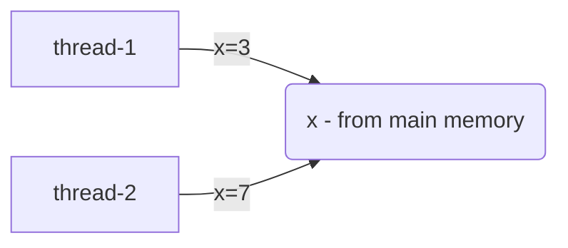

# Java Concurrency

## Basic Terms and Definitions
---
### Data Race 
Occurs when these are present:
- > 2 or more threads in a <strong>single process</strong> access the same memory location concurrently
- > at least one of the accesses is for writing
- > the threads are not using any exclusive locks to control their accesses to that memory

#### Sample

```
//share variable
int x = 0;

Runnable task1 = new Runnable() {
    @Override
    public void run() {
        x = 3;
    }
};

Runnable task2 = new Runnable() {
    @Override
    public void run() {
        x = 7;
    }
};

new Thread(task1).start();
new Thread(task2).start();
```


Both threads writing to same variable at the same time

In Java, this does not lead to data corruption. Java Language Specifications (JLS) mandates atomic writes of `ints`. However, this does not apply to `long` and `double`.

Reference: [Oracle] [1]


### Data Condition

#### Pattern #1:  Check and Update
#### Sample

```
//share variable
Map<String, String> loanedBooks = new HashMap(); //non-threadsafe, even if ConcurrentHashMap is used

// thread-1
if(!loandedBooks.containsKey("book1")){
    loandedBooks.put("book1","user3");
}

// thread-3
if(!loandedBooks.containsKey("book1")){
    loandedBooks.put("book1","user7");
}

```
Thread-scheduling or ordering in Java is not guaranteed. So the above code does not guarantee proper ordering. This leads to Race Condition as the output of computation depends on relative ordering of threads/instructions.

Solution using Locks

```
// thread-1
lock.lock();
if(!loandedBooks.containsKey("book1")){
    loandedBooks.put("book1","user3");
}
lock.unlock();

// thread-3
lock.lock();
if(!loandedBooks.containsKey("book1")){
    loandedBooks.put("book1","user7");
}
lock.unlock();

```

[1]: https://docs.oracle.com/cd/E19205-01/820-0619/geojs/index.html 
